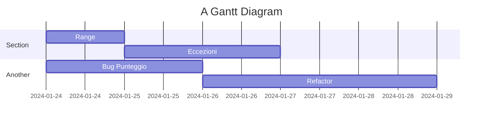

# BETA TEST GUESS MY NUMBER

## OBIETTIVI

Testare il gioco, segnalare eventuali bug, consigli e spunti sull'user experience.
- Eccezioni del try-catch
  prova bene tutte le eccezioni possibili:
  inserire stringhe invece che numeri, provare numeri troppo grossi ecc.

### BUG:
Controllare problema x che non sono riuscito a risolvere

### USER EXPERIENCE:
- Hai suggerimenti per migliorare l'esperienza dell'utente su questo gioco?
- Come valuti l'usabilità e la chiarezza del gioco?
- I colori utilizzati nei messaggi all'utente sono leggibili?

## POST BETA TEST:

 Feedback di Ale 

>  **Eccezioni**

- [x] stringhe
- [ ] numeri maggiori o minori

>  **Bug**
- [x] punteggio

> **Miglioramenti**
- [x] esplicitare il range di numeri tra i quali indovinare
- [x] togliere True e False dai messaggi in console

Priorità
1. Range 
2. Eccezioni
3. Bug Punteggio
## Tempistica di sviluppo

