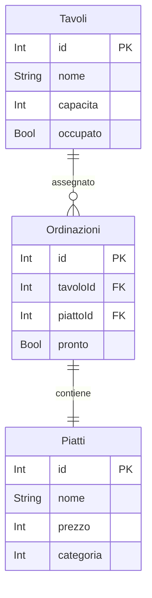

# App per Ristoranti

Questo progetto è un'applicazione per la gestione di ristoranti, sviluppata in C# utilizzando il framework Entity Framework 
e seguendo il modello di progettazione MVC (Model-View-Controller).

## Funzionalità

L'applicazione offre le seguenti funzionalità:

1. **Piatti**:
   - Gestione delle portate (antipasti, primi, secondi, dessert, ecc.).
   - Aggiunta, modifica ed eliminazione dei piatti all'interno delle portate.
   - Visualizzazione dei dettagli dei piatti.

2. **Tavoli**:
   - Creazione e gestione dei tavoli del ristorante.
   - Assegnazione di tavoli ai clienti in base alla capacità.
   - Monitoraggio dello stato dei tavoli (liberi, occupati).
   - Quando diventa libero cancellare tutti gli ordini del tavolo (significa che i clienti hanno pagato e se ne sono andati).

3. **Ordinazioni**:
   - Registrazione delle ordinazioni dei clienti.
   - Collegamento delle ordinazioni ai tavoli e ai piatti.
   - File per la cucina con solo nome del piatto e quantità
   - Calcolo del totale dell'ordine nella cassa.

## Struttura del Progetto

- `Models`: Contiene le classi delle entità (Piatti, Tavoli, Ordinazioni).
- `Views`: Contiene le viste dell'applicazione (interfaccia utente).
- `Controllers`: Contiene i controller che gestiscono le richieste degli utenti e interagiscono con il modello di dati.

## Requisiti

- Entity Framework installato nel progetto.
- un file .json con il trio di tipo, piatti e prezzi 

## TODO

1. **Creazione delle Classi delle Entità**:
   - Crea le classi per le entità "Piatti", "Tavoli", e "Ordinazioni".
   - Ogni classe dovrebbe corrispondere a una tabella nel database.

2. **Creazione del Contesto del Database**:
   - Crea una classe `Database` che estende `DbContext`.
   - Configura le proprietà DbSet per le tue entità.

3. **Migrazioni e Creazione del Database**:
   - Utilizza le migrazioni di Entity Framework per creare il database.
   - Esegui il comando `dotnet ef migrations add InitialCreate` per creare una migrazione iniziale.
   - Esegui il comando `dotnet ef database update` per applicare la migrazione al database.

4. **Creazione dei Controller**:
   - Crea i controller per le entità (ad esempio `PiattiController`, ecc.).
   - Implementa le azioni CRUD (Create, Read, Update, Delete) per ciascuna entità.

5. **Implementazione della Logica**:
   - Nel controller, implementa la logica per gestire le operazioni sulle entità con gli Update (ad esempio la prenotazione di un tavolo, ecc.).

6. **Creazione delle Viste**:
   - Crea le viste per le diverse funzionalità dell'applicazione (ad esempio, la visualizzazione dei piatti, la gestione dei tavoli, ecc.).

# PIATTI VIEW

userà il metodo 
VisualizzaMenu per farmi leggere il menù
VisualizzaCategoria per farmi leggere gli antipasti, primi, secondi, pizza, vegano
VisualizzaPiattoSingolo per farmi leggere il prezzo di un piatto singolo e la sua descrizione

spectre console

# PIATTI CONTROLLER

userà i metodi:
- InserisciPiatto
- ModificaPiatto 
- CancellaPiatto
- CreaMenu dove fai add di Piatto ad un Menu specifico

# MENU VIEW

- visualizza elenco dei menu
- visualizza elenco dei piatti del menu

# MENU CONTROLLER 

- inserisci nuovo menu
- modifica i piatti del menu 
- elimina un menu

# Obiettivo

creare un'applicazione per un ristorante

con il menu diviso per sezioni

che permetta ai camerieri di prendere gli ordini dei diversi tavoli

e al cassiere di fare il conto totale in tempo reale

## Cosa deve fare il programma step by step

- [ ] chiedere il numero dei clienti (nc) e mostrare i tavoli di capacità >= nc && < nc+3
- [ ] chiedere il numero del tavolo in cui si siedono
- [ ] chiedere quale portata desiderano elencandoli (antipasti, primi, secondi)
- [ ] chiedere quale piatto di quella portata desiderano elencandoli (primi: Spaghetti, Ravioli, Penne)
- [ ] ricevere la sua ordinazione e salvarla con pronto settato false
- [ ] quando i piatti vengono portati settare pronto true
- [ ] sommare i valori dei piatti ordinati per far pagare il conto
- [ ] svuotare il file del tavolo che ha pagato e settare occupato false
- [ ] ringraziare e salutare

